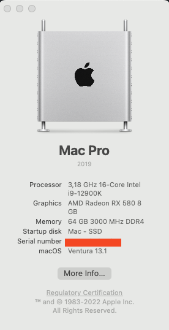

# OpenCore EFI




 **OpenCore EFI for Intel Alder Lake**

- Intel i9-12900K (All cores (P+E+HT) activated)
- Gigabyte Z690 Aorus Elite DDR4 AX (BIOS version F21)
- AMD Radeon RX 580 8GB dGPU
- 64 GB DDR4-3000, XMP enabled
- Wifi/BT via BRCM20702
- Windows 10 on a 2nd SSD
- MacOS Ventura 13.0.1 on a 3rd SSD
- [OC Version 0.9.0](https://github.com/acidanthera/OpenCorePkg/releases/tag/0.9.0)

# What is working?

Almost everything:
- MacOS Ventura 13.2.1
- Audio
- DP and HDMI via dGPU
	- Screen 1: 4k via DP
	- Screen 2: 1080p via HDMI
- DRM Content (Netflix, Amazon Prime, Apple TV+)
- Wifi/BT workingout of the box
- all iServices (iMessage, iCloud, AirDrop, unlock with Apple Watch)
- CPU temperature and fan speeds in iStats and/or Intel Power Gadget
- USB Ports mapped: 15 in use out of 21 possibly available
  - 2x USB 2.0 on the front panel via internal USB header (one port in USB mapping)
  - 4x USB 2.0 on the back (one port in USB mapping)
  - 1x RGB Fusion 2.0
  - 2x USB 3.2 Gen 1 on the front via internal USB header
  - 2x USB 3.2 Gen 2 on the back
  - 3x USB 3.2 Gen 1 on the back   
	- 3x with USB 2.0 personality
  - 2x USB-C (one back and front with up to 10 Gbps)
- Continuity Camera with iPhone 14 Pro

# Used Kexts?

| **Kext**  | **Version**  |
|:----------|:----------|
| [Lilu](https://github.com/acidanthera/Lilu/releases/tag/1.6.4)    | 1.6.4   |
| [AppleALC](https://github.com/acidanthera/AppleALC/releases/tag/1.8.0)| 1.8.0 |
| [WhateverGreen](https://github.com/acidanthera/WhateverGreen/releases/tag/1.6.4)    | 1.6.4    
| [VirtualSCM](https://github.com/acidanthera/VirtualSMC/releases/tag/1.3.1)    | 1.3.1    |
| [SMCProcessor](https://github.com/acidanthera/VirtualSMC/releases/tag/1.3.0)    | 1.3.0    |
| [SMCSuperIO](https://github.com/acidanthera/VirtualSMC/releases/tag/1.3.0)    | 1.3.0    |
| [CpuTopologyRebuild](https://github.com/b00t0x/CpuTopologyRebuild/releases/tag/1.1.0)    | 1.1.0    |
| [CpuTscSync](https://github.com/acidanthera/CpuTscSync/releases/tag/1.0.9)    | 1.0.9    |
| [NVMeFix](https://github.com/acidanthera/NVMeFix/releases/tag/1.1.0)    | 1.1.0    |
| [LucyRTL8125Ethernet](https://www.insanelymac.com/forum/files/file/1004-lucyrtl8125ethernet/)    | 1.1.0    |
| [RadeonSensor](https://github.com/aluveitie/RadeonSensor/releases/tag/0.3.1) | 0.3.1 |
| [RestrictEvents](https://github.com/acidanthera/RestrictEvents/releases/tag/1.0.9) | 1.0.9 | 
| [CPUFriend](https://github.com/acidanthera/CPUFriend/releases/tag/1.2.6) | 1.2.6 | 


# Motivation?

I set up my first hack based on a **AMD Ryzen 9 3900X** and a **Gigabyte X570 Aorus Elite** mainboard. After having the USB mapped as expected, that hack was working well over the years. Survived the updates to Monterey and Ventura w/o issues. But with Venturae more and more software was not working any longer. So, I was running into more issues with **Photoshop** and **Virtualbox** was not working any longer at all. Especially Virtualbox was needed to get UEFI Secure Boot working since I used Debian to sign the OpenCore EFI files.  
After that I decided to switch to Intel by just replacing the mainboard and CPU.

# What doesn't work well?

Sleep at all, I guess. Haven't had the chance to get into sleep yet.

# Current State?

I guess, finally I resolved my USB issues. I've attached a LaCie Rugged device since years, but somehow when connected to any port that device leads to a stucked boot. As soon as the device is disconnected, booting is possible w/o any issues. Strange!

Introduced CPUFriend and CPUFriendDataProvider according to the following [bug](https://github.com/dortania/bugtracker/issues/190).  
Geekbench 5 benchmark test also increased for both, single  and multi-core tests
See result [before](./images/MacPro7,1-Geekbench_Browser_without_CPUFriend.mht.png) and [after](./images/MacPro7,1-Geekbench_Browser_with_CPUFriend.mht.png) adding CPUFriend.kext.

For comparison reason I've uploaded the Geekbench reference done on [Windows 10 22H2](./images/MacPro7,1-Geekbench_Windows_Reference.png). On Windows a slightly better multi-core performance can be measured compared to the CPUFriend.kext version used on MacOS.

At the moment I'm being quite satisfied with the system. 

# Outlook?
- [x] One of the next steps will be to re-enable UEFI Secure Boot again. (signed files will not be uploaded).  
- [x] Try to solve the USB-C boot issue
- [x] Solve the "Boot gets stuck" issue when USB devices are connected to the front panel. 

# Followed Guides?

1. Followed the Comet Lake guide provided by Dorania:  
[Dortania Team](https://dortania.github.io/OpenCore-Install-Guide/config.plist/comet-lake.html)

2. Alder Lake adaptations done according to:  
[ChrisWayg](https://chriswayg.gitbook.io/opencore-visual-beginners-guide/advanced-topics/using-alder-lake)

````text
Before just copying a config.plist from the internet go through the guids and start from skratch  
with the sample.plist provided by Dortania by your own and take that just for reference.
````  

# Disclaimer

I don't take guarantee for any hack based on that config. You do that on your own risk!

# Thanks/Credits

Since I've followed the two guides mentioned above, thanks to these guys!