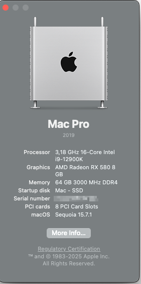

# OpenCore EFI




 **OpenCore EFI for Intel Alder Lake**

- Intel i9-12900K (All cores (P+E+HT) activated)
- Gigabyte Z690 Aorus Elite DDR4 AX (BIOS version F21)
- AMD Radeon RX 580 8GB dGPU
- 64 GB DDR4-3000, XMP enabled
- Wifi/BT via BRCM20702
- Windows 10 on a 2nd SSD
- MacOS Sonoma 14.0 on a 3rd SSD (with expected WIFI not working, etc.)
- [OC Version 0.9.7](https://github.com/acidanthera/OpenCorePkg/releases/tag/0.9.7)

# What is working?

**Almost everything:**
  
- MacOS Sonoma 14.3 
- Audio  
- DP and HDMI via dGPU  
- Screen 1: 4k via DP  
- Screen 2: 1080p via HDMI  
- DRM Content (Netflix, Amazon Prime, Apple TV+)  
- Wifi/BT working after OCLP root patching
- all iServices (iMessage, iCloud, AirDrop, unlock with Apple Watch)  
- CPU temperature and fan speeds in iStats and/or Intel Power Gadget  
- USB Ports mapped: 15 in use out of 21 possibly available  
  - 2x USB 2.0 on the front panel via internal USB header (one port in USB mapping)  
  - 4x USB 2.0 on the back (one port in USB mapping)  
  - 1x RGB Fusion 2.0  
  - 2x USB 3.2 Gen 1 on the front via internal USB header  
  - 2x USB 3.2 Gen 2 on the back  
  - 3x USB 3.2 Gen 1 on the back     
	- 3x with USB 2.0 personality  
  - 2x USB-C (one back and front with up to 10 Gbps)  
- Continuity Camera with iPhone 14 Pro  

# Used Kexts?

| **Kext**  | **Version**  |   |
|:----------|:----------|:---|
| [Lilu](https://github.com/acidanthera/Lilu/releases/tag/1.6.7)    | 1.6.7   | 
| [AppleALC](https://github.com/acidanthera/AppleALC/releases/tag/1.8.8)| 1.8.8 |  
| [WhateverGreen](https://github.com/acidanthera/WhateverGreen/releases/tag/1.6.6)    | 1.6.6 
| [VirtualSMC](https://github.com/acidanthera/VirtualSMC/releases/tag/1.3.2)    | 1.3.2    
| [SMCProcessor](https://github.com/acidanthera/VirtualSMC/releases/tag/1.3.2)    | 1.3.2    
| [SMCSuperIO](https://github.com/acidanthera/VirtualSMC/releases/tag/1.3.2)    | 1.3.2    
| [CpuTopologyRebuild](https://github.com/b00t0x/CpuTopologyRebuild/releases/tag/1.1.0)    | 1.1.0    
| [CpuTscSync](https://github.com/acidanthera/CpuTscSync/releases/tag/1.1.1)    | 1.1.1    
| [NVMeFix](https://github.com/acidanthera/NVMeFix/releases/tag/1.1.1)    | 1.1.1    
| [LucyRTL8125Ethernet](https://www.insanelymac.com/forum/files/file/1004-lucyrtl8125ethernet/)    | 1.1.0  
| [RadeonSensor](https://github.com/aluveitie/RadeonSensor/releases/tag/0.3.1) | 0.3.1 
| [RestrictEvents](https://github.com/acidanthera/RestrictEvents/releases/tag/1.1.3) | 1.1.3 |
| [CPUFriend](https://github.com/acidanthera/CPUFriend/releases/tag/1.2.8) | 1.2.8 |  
| [AMFIPass](https://github.com/dortania/OpenCore-Legacy-Patcher/blob/main/payloads/Kexts/Acidanthera/AMFIPass-v1.4.0-RELEASE.zip) | 1.4.0 |  
| [BlueToolFixup](https://github.com/dortania/OpenCore-Legacy-Patcher/blob/main/payloads/Kexts/Acidanthera/BlueToolFixup-v2.6.8-RELEASE.zip) | 2.6.8 |  
| [IOSkywalkFamily](https://github.com/dortania/OpenCore-Legacy-Patcher/blob/main/payloads/Kexts/Wifi/IOSkywalkFamily-v1.0.0.zip) | 1.0.0 |  
| [IO80211FamilyLegacy](https://github.com/dortania/OpenCore-Legacy-Patcher/blob/main/payloads/Kexts/Wifi/IO80211FamilyLegacy-v1.0.0.zip) | 1.0.0 |  
| [AirPortBrcmNIC](https://github.com/dortania/OpenCore-Legacy-Patcher/blob/main/payloads/Kexts/Wifi/IO80211FamilyLegacy-v1.0.0.zip) | 1.0.0 |  


# Motivation?

I set up my first hack based on a **AMD Ryzen 9 3900X** and a **Gigabyte X570 Aorus Elite** mainboard. After having the USB mapped as expected, that hack was working well over the years. Survived the updates to Monterey and Ventura w/o issues. But with Venturae more and more software was not working any longer. So, I was running into more issues with **Photoshop** and **Virtualbox** was not working any longer at all. Especially Virtualbox was needed to get UEFI Secure Boot working since I used Debian to sign the OpenCore EFI files.  
After that I decided to switch to Intel by just replacing the mainboard and CPU.

# What doesn't work well?

Sleep at all, I guess. Haven't had the chance to get into sleep yet.

# Current State?

The 13.3.1 update was somehow a mess. System was up and running well and I just pressed the "Update Now" button in the System Settings dialog. System booted and was stuck at the Apple Logo. Nothing went forward. Trying to incorporate a time machine backup was somehow messing up the system even more. At the end, I prepared a new USB stick for a fresh install, had to disable the iGPU in BIOS to get Apple to boot again. After system was up and running again, I was switching on iGPU again and system behaves like before.

_I guess, finally I resolved my USB issues. I've attached a LaCie Rugged device since years, but somehow when connected to any port that device leads to a stucked boot. As soon as the device is disconnected, booting is possible w/o any issues. Strange!_

Introduced CPUFriend and CPUFriendDataProvider according to the following [bug](https://github.com/dortania/bugtracker/issues/190).  
Geekbench 5 benchmark test also increased for both, single  and multi-core tests
See result [before](./images/MacPro7,1-Geekbench_Browser_without_CPUFriend.mht.png) and [after](./images/MacPro7,1-Geekbench_Browser_with_CPUFriend.mht.png) adding CPUFriend.kext.

For comparison reason I've uploaded the Geekbench reference done on [Windows 10 22H2](./images/MacPro7,1-Geekbench_Windows_Reference.png). On Windows a slightly better multi-core performance can be measured compared to the CPUFriend.kext version used on MacOS.

At the moment I'm being quite satisfied with the system, nevertheless I'm struggling with a quite strange issue since a few weeks. Even before the update to Sonoma my system started to crash randomly. Out of sudden all the USB devices, including bluetooth devices gets disconnected. Up to know only a reboot resolves that. While I'm able to use the computer using Remote Pro on my iPhone I checked IORegistryExplorer after a crash and saw that my whole XHCI controller gets disconnected. Also quite interesting, that happens around 1:30-1:40 am daily. So, something smashes my USB mapping. If there's someone with an helping hand out there, please get back to me.
Attached an example of the bluetoothd process crash as seen in the Console app: [crash.txt](./crash.txt)

**[Update]** After removing possible root causes step by step (i. e. all external USB devices), I also exchagned my Logitech mouse by the Logitech Bolt version. Since that day, I've not had any bluetoothd process crash. So, I'm quite obtimistic that I've found the root cause of my issues. Maybe the bluetooth implementation of the Bolt based keyboard and Unifying mouse resulted in that behaviour.

**[Update 2]** After a not many weeks the issue came back, so I decided to remove the Logitech Bolt and switch to native Bluetooth for mouse and keyboard until I get a clue what's going on.

# Outlook?
...


# Followed Guides?

1. Followed the Comet Lake guide provided by Dorania: 
[Dortania Team](https://dortania.github.io/OpenCore-Install-Guide/config.plist/comet-lake.html)

2. Alder Lake adaptations done according to: [ChrisWayg](https://chriswayg.gitbook.io/opencore-visual-beginners-guide/advanced-topics/using-alder-lake)

3. Root patching using OCLP [perez987](https://github.com/perez987/macOS-14-Sonoma-on-z390-with-OpenCore)

````text
Before just copying a config.plist from the internet go through the guids and start from skratch  
with the sample.plist provided by Dortania by your own and take that just for reference.
````  

# Disclaimer

I don't take guarantee for any hack based on that config. You do that on your own risk!

# Thanks/Credits

Since I've followed the two guides mentioned above, thanks to these guys!